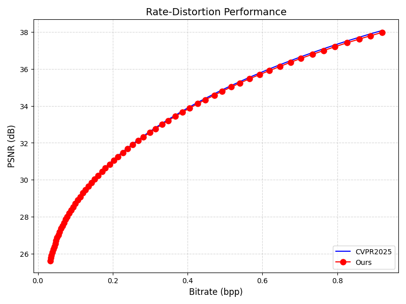
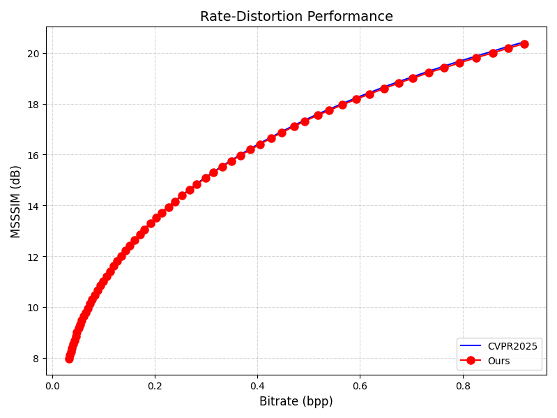
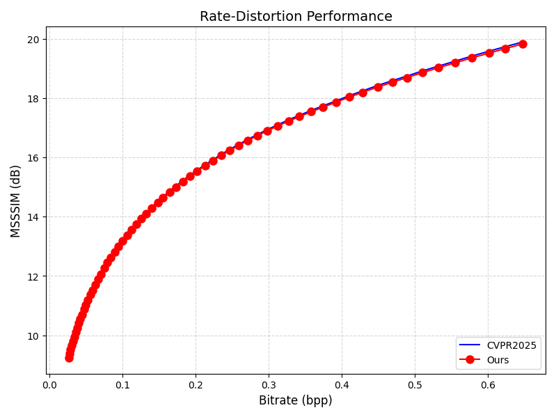
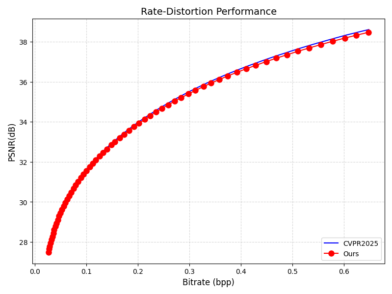
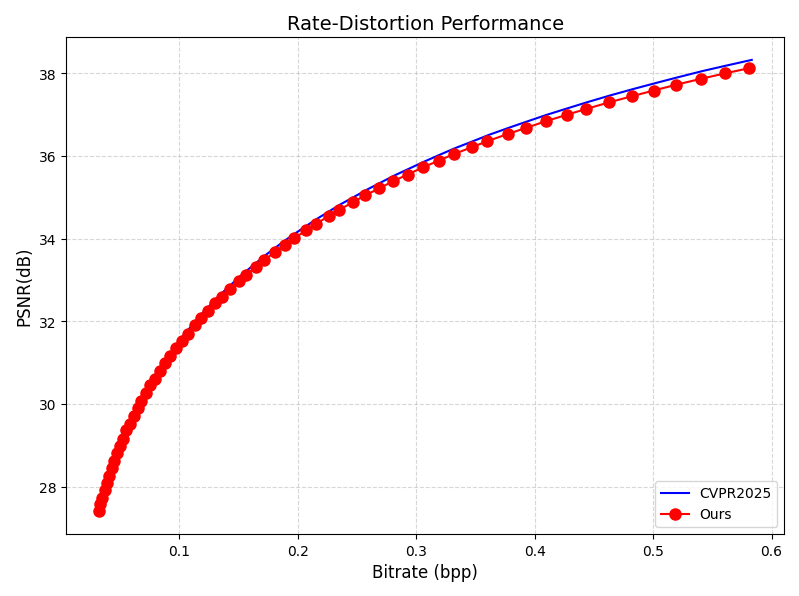
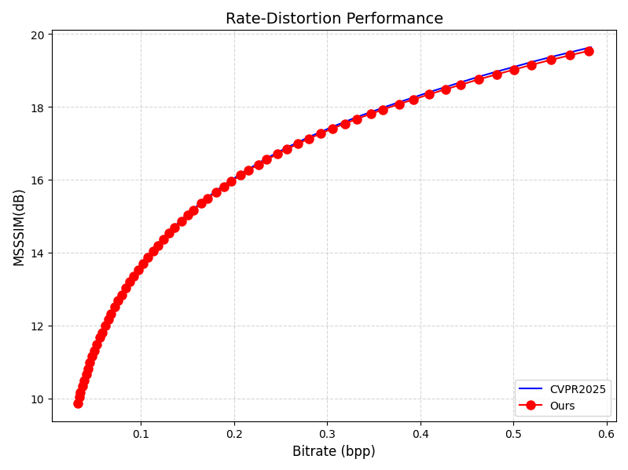
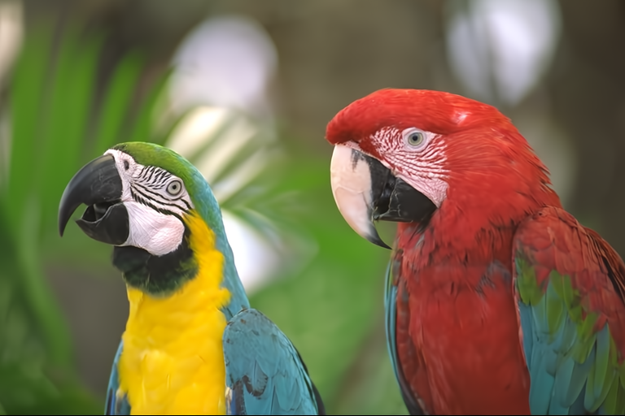
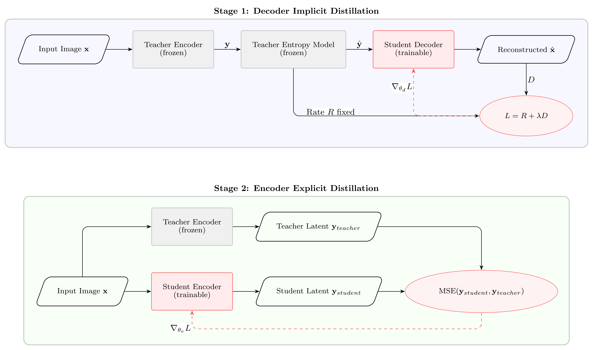

# Lightweight Image Compression Model Based on DCVC-RT Intra-frame Model

---

## 📖 Project Overview
This project presents a lightweight end-to-end neural image compression model based on the intra-coding module of DCVC-RT, a state-of-the-art real-time deep video compression framework. To address the high computational complexity and large parameter size of existing high-performance neural compression models that hinder deployment on resource-constrained edge devices, we adopt **structured channel pruning** and a **two-stage explicit-implicit knowledge distillation** strategy.

Our lightweight model achieves a BD-rate of **-12.73%** compared to VVC (VTM-9.1) on an NVIDIA RTX 4090 GPU, while reducing decoder parameters by 32.33% and overall floating-point operations (FLOPs) by 23.65%. It achieves an optimal balance between rate-distortion performance and computational efficiency among all compared state-of-the-art methods.

---

## 📊 Model Performance
All experiments are conducted on an **NVIDIA RTX 4090 GPU** with half-precision (FP16) inference to simulate real-world deployment scenarios.

### Core Metrics Comparison
| Model | Encoder Params (M) | Decoder Params (M) | Total Params (M) | FLOPs (G) | BD-rate (vs VTM-9.1) |
|:------|:-------------------|:-------------------|:-----------------|:----------|:---------------------|
| Original DCVC-RT | 8.55 | 14.91 | 45.51 | 191.25 | -13.88% |
| **Ours (Lightweight)** | **5.83** | **10.09** | **37.97** | **146.01** | **-12.73%** |
| VVC (VTM-9.1) | - | - | - | - | 0.00% |

### Rate-Distortion Performance on Standard Datasets
We evaluate our model on three widely used international image compression benchmarks. All figures show PSNR (left) and MS-SSIM (right) curves side by side.

#### Kodak Dataset (24 classic test images)
<table>
  <tr>
    <td align="center"><b>PSNR Comparison</b></td>
    <td align="center"><b>MS-SSIM Comparison</b></td>
  </tr>
  <tr>
    <td></td>
    <td></td>
  </tr>
</table>
> Upload your paper's Figure 4-1, split into two separate images named `fig4-1_psnr.png` and `fig4-1_msssim.png`

#### CLIC Professional Validation Set (2K resolution images)
<table>
  <tr>
    <td align="center"><b>PSNR Comparison</b></td>
    <td align="center"><b>MS-SSIM Comparison</b></td>
  </tr>
  <tr>
    <td></td>
    <td></td>
  </tr>
</table>
> Upload your paper's Figure 4-2, split into two separate images named `fig4-2_psnr.png` and `fig4-2_msssim.png`

#### Tecnick Test Set (1200×1200 resolution images)
<table>
  <tr>
    <td align="center"><b>PSNR Comparison</b></td>
    <td align="center"><b>MS-SSIM Comparison</b></td>
  </tr>
  <tr>
    <td></td>
    <td></td>
  </tr>
</table>
> Upload your paper's Figure 4-3, split into two separate images named `fig4-3_psnr.png` and `fig4-3_msssim.png`

### Reconstruction Visualization (qp=56)
Comparison of original image, original DCVC-RT reconstruction and our lightweight model reconstruction at qp=56 (bpp≈0.268):
<table>
  <tr>
    <td align="center"><b>Original Image</b></td>
    <td align="center"><b>Original DCVC-RT</b></td>
    <td align="center"><b>Ours (Lightweight)</b></td>
  </tr>
  <tr>
    <td></td>
    <td></td>
    <td></td>
  </tr>
</table>
> Upload three separate images: original image (kodim23.png), original model reconstruction at qp=56, and our lightweight model reconstruction at qp=56

---

## 🛠️ Model Design and Implementation
### Overall Approach
1.  **Baseline Selection**: We use the DCVC-RT intra-frame model as the teacher model, which inherently features low latency due to its single-scale low-resolution latent representation design.
2.  **Structured Channel Pruning**: We keep the entropy model and hyperprior network completely unchanged, and only reduce the internal core channel number of the encoder and decoder from 368 to 300.
3.  **Two-Stage Hybrid Distillation**: We adopt different distillation strategies for the encoder and decoder according to their functional differences to maximize knowledge transfer efficiency.

### Implementation Steps
#### Step 1: Structured Channel Pruning
- Only prune the internal channel number of DC Blocks in the encoder and decoder
- Entropy model, hyperprior network, quantization scaling factors and other modules remain unchanged
- The pruned student model shares the same architecture as the teacher model, avoiding knowledge transfer barriers caused by cross-architecture distillation

#### Step 2: Two-Stage Explicit-Implicit Distillation

> Upload your paper's Figure 3-6 (the proposed two-stage distillation scheme) as `fig3-6.png`

1.  **Decoder Implicit End-to-End Distillation**
    - Embed the student decoder into the frozen teacher model pipeline
    - Freeze all parameters of the teacher encoder, entropy model and hyperprior network
    - Train the decoder only with rate-distortion loss, where the training objective reduces to maximizing reconstruction quality under a fixed bitrate budget

2.  **Encoder Explicit Feature Alignment Distillation**
    - Load and freeze the well-trained student decoder weights from the first step
    - Use the latent representation output by the teacher encoder as the supervision signal
    - Train the student encoder with mean squared error (MSE) loss to directly inherit the feature extraction capability of the teacher model

3.  **Model Merging**
    - Merge the trained encoder module, decoder module and other modules of the original teacher model using the `merge_ckp.py` script
    - Generate the final complete lightweight model weights

---

## 📂 Project Structure
```text
.
├── README.md
├── distillation_dec.py      # Decoder distillation training code
├── distillation_enc.py      # Encoder distillation training code
├── merge_ckp.py             # Merge trained modules to generate complete model
├── model_val.py             # Calculate model parameters and FLOPs
├── test_image4train.py      # Test model rate-distortion performance
├── results/                 # Experimental result data
│   ├── real_prune_clic_half.json    # Half-precision test results of lightweight model on CLIC validation set
│   ├── real_prune_kodak_half.json   # Half-precision test results of lightweight model on Kodak dataset
│   ├── real_prune_tecnick_half.json # Half-precision test results of lightweight model on Tecnick test set
│   ├── real_raw_clic_half.json      # Half-precision test results of original model on CLIC validation set
│   ├── real_raw_kodak_half.json     # Half-precision test results of original model on Kodak dataset
│   └── real_raw_tecnick_half.json   # Half-precision test results of original model on Tecnick test set
├── src/                     # Core source code
│   ├── cpp/                 # C++ extensions for entropy coding and CUDA inference
│   ├── datasets/            # Dataset loading utilities
│   ├── layers/              # Network layers and CUDA kernels
│   ├── models/              # Model definitions
│   │   ├── image_model4train2.py    # Trainable version of the original DCVC-RT intra-frame model
│   │   └── img_prune.py             # Lightweight model definition
│   └── utils/               # Common utilities and metrics
└── test_image/              # Standard test datasets
    ├── clic2020_professional_valid/
    ├── kodak/
    └── tecnick/
```
## ⚙️ Environment Setup
This project directly reuses the official DCVC-RT runtime environment. Please refer to the DCVC-RT official repository for detailed environment configuration instructions.

## 📄 Citation
If this work is helpful for your research, please cite the original DCVC-RT paper:
```text
@inproceedings{jia2025dcvcrt,
  title={Towards Practical Real-Time Neural Video Compression},
  author={Jia, Zhaoyang and Li, Bin and Li, Jiahao and Xie, Wenxuan and Qi, Linfeng and Li, Houqiang and Lu, Yan},
  booktitle={2025 IEEE/CVF Conference on Computer Vision and Pattern Recognition (CVPR)},
  pages={12543--12552},
  year={2025}
}
```
